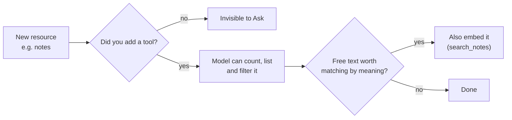

# FastAPI AI — the working AI project (Workers AI + Groq, plus chat-history search)

This app keeps the same portability pattern as the sibling
[`fastapi-cloudflare-d1`](../fastapi-cloudflare-d1) project:

- **Local uvicorn/Docker** uses SQLite through the shared `Database` protocol
  for user records.
- **Cloudflare Workers** can use the native D1 binding (`env.DB`) through the
  same protocol, and reaches **Workers AI** through the native `env.AI`
  binding declared in `wrangler.jsonc` (or its REST API when running
  anywhere else).
- **Groq** is a second chat provider, called through its OpenAI-compatible
  API. Each chat records which provider it uses (chosen when it's created).

The repository layer does not know whether the database is SQLite or
Cloudflare D1, and the chat service does not know which AI provider it is
talking to — both sit behind small adapters (`core/config/database.py`,
`core/ai/ai.py`).

The code follows the same conventions as [`fastapi-template`](../fastapi-template):
one package per domain, one typed class per layer, and the generic
`ApiResponse` envelope (see "Code conventions").

> **This is where new AI work happens.** [`fastapi-cloudflare-ai`](../fastapi-cloudflare-ai)
> (Workers AI only) and [`fastapi-groq-ai`](../fastapi-groq-ai) (Groq only) are kept
> as reference/resource projects. All three share the **same Clerk instance and
> the same D1 database** (`demo-db`). This project owns both `cloudflare` and
> `groq` chats and advertises `aiChats` on the user profile (used by `demo-ui`
> Home page card). It also has **AI search over chat history** — see
> [`docs/ask-your-data.md`](docs/ask-your-data.md) (the AI assistant: todos, chats, ...),
> [`docs/how-ai-search-works.md`](docs/how-ai-search-works.md) (diagrams),
> [`docs/architecture.md`](docs/architecture.md) and
> [`docs/ai-search-plan.md`](docs/ai-search-plan.md).

## Status

✅ **Working end to end, locally.** Auth, user records, and a ChatGPT-style
`/api/users/{user_id}/chats` feature (list chats, open one, rename it, send a message, get an
AI reply from Cloudflare Workers AI or Groq) are wired up. Not yet deployed —
see "Deploying to Cloudflare" below.

> **Runs on port 8001 — same as every other Python tutorial project in this
> repo** (`fastapi-cloudflare-d1`, `fastapi-template`, ...). The `showcase`
> Angular app's API base URL is a single fixed value, not one per backend, so
> only one of these services is ever meant to run locally at a time. Stop
> whichever one is running before starting this one.

## Why a separate project?

Same reasoning as `fastapi-cloudflare-d1`: routers, services, DTOs, the
response envelope, metadata/links/templates, UUIDs, and UTC date formatting
are reused patterns, not reinvented per project, so this app can move to
Docker, Render, or another host without touching business logic.

## Project Structure

One package per domain. Each has a `{domain}_router.py` (HTTP only), a
`{domain}_service.py` (business rules, links, metadata, the response), a
`{domain}_repository.py` (SQL), `models.py` (database rows), `schemas.py`
(Request, DTO, Metadata and the typed responses) and `constants.py` (the
`_data` names and link names). `core/` is cross-cutting and never imports a
domain.

```
fastapi-ai/
├── src/
│   ├── main.py                  # Plain FastAPI app for uvicorn/Docker: registers every router
│   ├── entry.py                 # Cloudflare Workers ASGI entrypoint (wraps main.app)
│   ├── core/
│   │   ├── common/              # ApiResponse + API_PREFIX, Link/EmbeddedRef/FieldMetadata/Message,
│   │   │                        # UTC dates (UtcDateTime), AppError + its exception handler
│   │   ├── config/              # config (Worker env / .env / OS env), database adapters + migrations, CORS
│   │   ├── security/            # auth (Clerk JWT), authorization (Caller, get_caller,
│   │   │                        # require_admin, require_owner), roles
│   │   └── ai/                  # AI protocol (Workers AI REST/binding, Groq), LLM client,
│   │                            # embeddings, vector stores
│   ├── metrics/                 # /api/health
│   ├── users/                   # /api/users; dependencies.py creates the caller's user on first sight
│   │   ├── profiles/            # /api/me and /api/users/{id}/profile (where every link lives)
│   │   └── settings/            # /api/users/{id}/settings (personal)
│   ├── shared/settings/region/  # region settings data + /api/admin/settings (admins)
│   ├── todos/                   # /api/users/{id}/todos, plus todo search
│   ├── tags/                    # /api/tags
│   ├── chats/                   # /api/users/{id}/chats, plus chat search
│   ├── assistant/               # /api/users/{id}/assistant/ask
│   │   └── tools/               # the read-only tools the model may call
│   ├── groups/                  # /api/groups, members, followers, GroupPermissions,
│   │   │                        # social_query_repository (the assistant's questions)
│   │   └── posts/               # /api/groups/{id}/posts, likes, media, tagged people, post search
│   │       └── comments/        # /api/groups/{id}/posts/{id}/comments
│   ├── timeline/                # /api/timeline/posts
│   ├── media/                   # /api/media/unsplash/search and the media providers
│   └── admin/                   # /api/admin (admins)
│       └── analytics/           # /api/admin/analytics/engagement
├── migrations/                  # Auto-applied to local SQLite (001 ... 015)
├── tests/                       # pytest: services on temp SQLite, API through TestClient
├── Dockerfile
├── docker-compose.yml
├── .env.example                  # Copy to .env — see "Configuration"
├── schema.sql                    # Consolidated snapshot of the migrations,
│                                  # applied manually to D1 via wrangler
├── wrangler.jsonc                # Worker config + Workers AI binding + D1 binding
├── pyproject.toml
├── uv.lock
└── .gitignore
```

## Code conventions

The full rules live in [`../PYTHON_APP_CONVENTIONS.md`](../PYTHON_APP_CONVENTIONS.md);
[`fastapi-template`](../fastapi-template) is the small reference. In short:

**One class per layer, named for the layer.** `todos/` is a compact example:

| Layer | Suffix | Example | Built by |
|---|---|---|---|
| Database row (entity) | `Model` | `TodoModel` in `models.py` | repository |
| Request body | `Request` | `TodoCreateRequest`, `TodoUpdateRequest` in `schemas.py` | client; FastAPI validates it |
| What the service returns | `DTO` | `TodoDTO` in `schemas.py` (with `links`) | application service |
| Field rules for the client | `Metadata` | `TodoMetadata` in `schemas.py` | application service |
| HTTP response envelope | `Response` | `TodoResponse = ApiResponse[TodoDTO, TodoMetadata]` in `schemas.py` | application service |

- Repositories return models, never dicts; rows become models in one place
  (`_to_model`). Dates in models are `UtcDateTime`, so they are always
  timezone-aware.
- Every non-delete response is an `ApiResponse` built by the service
  (`build_response`, `build_list_response`, ...). The `_data` name comes from
  `constants.py`; a response with no field rules uses `NoMetadata` (`{}`).
- `_messages` is always present, an empty array when there is nothing to say.
  `FieldMetadata` drops unset flags on its own, so routes don't use
  `response_model_exclude_none`.
- Business-rule failures are exceptions from `core/common/errors.py`
  (`NotFoundError` 404, `ForbiddenError` 403, `ConflictError` 409, ...) or a
  domain's own subclass (`users/exceptions.py`). One handler turns them into
  `{"detail": ...}` with the right status, so routers don't need try/except.
  "Not found" for a single lookup is still `None` and a `404` in the router.
- Some models carry values filled in per caller, not columns (a post's
  `liked_by_me` and `tagged_people`); they are marked as such in the class.

`/api/health` is the one exception to the envelope; it's an infrastructure
probe and returns a plain object.

## Prerequisites (one-time machine setup)

| Tool | Why | Install |
|---|---|---|
| Node.js + npm | Runs `wrangler` (the Cloudflare CLI) | https://nodejs.org (LTS) |
| `uv` | Python package/venv manager used by this project | PowerShell: `powershell -ExecutionPolicy ByPass -c "irm https://astral.sh/uv/install.ps1 \| iex"` <br> Git Bash / Linux / macOS: `curl -LsSf https://astral.sh/uv/install.sh \| sh` |
| Docker | Optional local SQLite container workflow | https://www.docker.com/products/docker-desktop/ |
| A free Cloudflare account | Required to call Workers AI (even in local `wrangler dev` — see below) | https://dash.cloudflare.com/sign-up |
| A Groq API key | Only if you want the Groq provider | https://console.groq.com/keys |

> **Corporate proxy / TLS-inspecting network note:** if `uv` fails with
> `invalid peer certificate: UnknownIssuer`, set `$env:UV_NATIVE_TLS = "true"`
> (PowerShell) before running `uv` commands, so it trusts the OS certificate
> store instead of its bundled roots. If `curl` fails with
> `schannel: ... CRYPT_E_NO_REVOCATION_CHECK`, add `--ssl-no-revoke` to the
> curl command.

> After installing `uv`, restart your terminal (or `source ~/.bashrc` in Git
> Bash) so the updated `PATH` picks up `~/.local/bin` where it installs.

## Authentication

Every endpoint except `/api/health` requires a Clerk-issued JWT:
`Authorization: Bearer <token>`. `core/security/auth.py` verifies it against
`CLERK_JWKS_URL`/`CLERK_AUDIENCE` (from `.env` or `wrangler.jsonc` `vars`) —
there is no dev bypass, so a plain `curl` with no header gets `401 Unauthorized`
on every route below.

The `demo-ui` Angular app handles sign-in end to end. To call the API
directly (`curl`, Swagger's "Try it out", etc.), sign in through that app and
copy the bearer token it sends — e.g. from your browser's Network tab on any
request to this API — into your own request.

### Roles

Roles live in our own `user_roles` table, not only in Clerk:

- **Clerk seeds them.** The first request (`/api/me` or any other route)
  creates the user with the roles in the token, matched case-insensitively.
  Every later request **adds** any token role the user doesn't have yet. It
  never removes one.
- **Our API is the source of truth after that.** An admin can grant or remove
  roles through `PUT /api/users/{id}`, and a role granted here survives even
  if Clerk stops sending it. To revoke a role, use the API, not Clerk.
- **`get_caller`** (`core/security/authorization.py`) returns a `Caller`
  with the caller's saved roles. **`require_admin`** guards admin-only routes
  (`403` unless those roles include `ADMIN`), and **`require_owner`** guards
  personal `/users/{id}/...` routes. They read `user_detail_view`, so `core/`
  never imports the `users` package.
- **Links follow permissions.** A non-admin gets no `updateUser` /
  `deleteUser` links and no `createUser` / `userTemplate` meta links. Nobody
  gets a `deleteUser` link on themselves.
- **No lockout:** an admin can't remove their own `ADMIN` role or delete
  themselves (`400`), so the system can't end up with no admin by accident.
- **Personal resources:** todos, AI chats, the assistant and your settings
  under `/api/users/{id}/...` are yours alone. Anyone else gets `403`, admins
  included, and the profile only links them on your own profile. Profiles
  themselves are viewable by everyone; only their owner may change one
  (`can_edit_profile`, ready for when a profile `PUT` is added).
- **Groups** have their own rules (owner, member, follower, and admins bypass
  them): see [`docs/social-groups.md`](docs/social-groups.md).

## Configuration

All infrastructure settings (models, base URLs, origins, credentials) live in
`.env` locally — copy `.env.example` and fill in the blanks; `.env` is
gitignored. Nothing infrastructure-related has a default in the code, so a
missing required value fails with an error naming it. In a deployed Worker
the non-secret values come from `wrangler.jsonc` `vars` and secrets from
`wrangler secret put`.

| Variable | Required | Purpose |
|---|---|---|
| `DATABASE_MODE` | No | `sqlite` (local), `d1_binding` (Worker) or `d1_http` — see "Database modes". Defaults to `d1_binding` when a D1 binding exists, otherwise `sqlite` |
| `DATABASE_PATH` | With `sqlite` | SQLite file path, e.g. `./local.db` |
| `MIGRATIONS_DIR` | No | Folder of SQL migrations applied to SQLite. Defaults to `./migrations` in the working directory (run from the project root); Docker sets `/app/migrations`. SQLite refuses to start if it's missing |
| `CF_D1_ACCOUNT_ID` | With `d1_http` | Cloudflare account id that owns the D1 database |
| `CF_D1_DATABASE_ID` | With `d1_http` | Id of the D1 database (`demo-db`) |
| `CF_D1_API_TOKEN` | With `d1_http` | Cloudflare API token with D1 edit access (secret) |
| `CORS_ORIGINS` | For a browser UI | Comma-separated frontend origins, read on every request (`src/core/config/cors.py`): `.env` locally, `wrangler.jsonc` `vars` in the Worker (set to the deployed demo-ui, `https://demo-ui-2pk.pages.dev`) |
| `AI_MODE` | No | `http` (Cloudflare REST API) or `binding` (`env.AI`). Defaults to `binding` inside a Worker, otherwise `http` |
| `CF_AI_ACCOUNT_ID` | With `http` | Cloudflare account id used for Workers AI |
| `CF_AI_API_TOKEN` | With `http` | Cloudflare API token with Workers AI access (secret) |
| `CF_AI_MODEL` | Yes | Workers AI model for Cloudflare chats |
| `CF_EMBEDDING_MODEL` | No | Workers AI embedding model for chat search (default `@cf/baai/bge-base-en-v1.5`) |
| `GROQ_API_KEY` | For Groq chats | Groq API key (secret) |
| `GROQ_BASE_URL` | For Groq chats | Groq's OpenAI-compatible base URL |
| `GROQ_MODEL` | For Groq chats | Model used for Groq chats |
| `CLERK_JWKS_URL` | Yes | Clerk JWKS endpoint the API verifies tokens against |
| `CLERK_AUDIENCE` | Yes | JWT audience (the Clerk JWT template name) |
| `CLERK_AUTHORIZED_PARTIES` | No | Comma-separated frontend origins; when set, the token's `azp` claim must match one |

`CF_AI_MODEL` must be a model your Cloudflare plan can use — some
newer/larger ones (e.g. `@cf/moonshotai/kimi-k2.7-code`) return `403` with
"not available on the Workers Free plan", and old ones get retired with a `410`
(`@cf/meta/llama-3.1-8b-instruct` was deprecated on 2026-05-30). The default,
`@cf/meta/llama-4-scout-17b-16e-instruct`, is fast and handles the Ask tools well.
Groq and Workers AI are both called with plain `httpx` (`src/core/ai/llm.py`), not the
`openai` package, which cost about 1.4 s of CPU to load on a cold Worker.

## Database modes

Set **one active** `DATABASE_MODE` at a time:

```env
# Local uvicorn/Docker
DATABASE_MODE=sqlite
DATABASE_PATH=./local.db

# Cloudflare Workers native binding — wrangler.jsonc already has a
# d1_databases block (its own "demo-db" database, not shared with
# fastapi-cloudflare-d1's todo-db)
DATABASE_MODE=d1_binding

# Optional: non-Worker host using Cloudflare D1 over HTTP
DATABASE_MODE=d1_http
CF_D1_ACCOUNT_ID=...
CF_D1_DATABASE_ID=...
CF_D1_API_TOKEN=...
```

Do not keep multiple `DATABASE_MODE=` lines active in the same `.env`; the
last one wins.

### Running locally against the real D1 database

To run uvicorn locally with your data in `demo-db` instead of SQLite:

1. Apply the schema to the remote database once (see "Deploying to
   Cloudflare", step 2).
2. In `.env`, fill in `CF_D1_ACCOUNT_ID` and `CF_D1_API_TOKEN` (create the token
   in the Cloudflare dashboard under My Profile → API Tokens, with **D1 →
   Edit**); `CF_D1_DATABASE_ID` is already set.
3. Set `DATABASE_MODE=d1_http` (replacing `sqlite`) and start uvicorn as
   usual.

Every request then goes over the Cloudflare REST API, so it is slower than
SQLite, and changes are made to the live database.

## Running locally with SQLite and uvicorn

This mode does not use Wrangler or Cloudflare. Migrations are applied
automatically from `migrations/` the first time the SQLite file is opened.
Run from the project root (or set `MIGRATIONS_DIR`): without the folder,
SQLite refuses to start rather than run with no tables.

```powershell
uv sync

Copy-Item .env.example .env
# Fill in the credentials (see "Configuration"); keep DATABASE_MODE=sqlite

uv run uvicorn main:app --app-dir src --host 127.0.0.1 --port 8001 --reload
```

Server runs at `http://127.0.0.1:8001`.

## Running locally with Docker + SQLite

```powershell
Copy-Item .env.example .env   # then fill in the credentials
docker compose up --build
```

The SQLite database lives in the named Docker volume `sqlite-data` at
`/data/local.db`, so it behaves the same on Windows, macOS, and Linux.

## Running locally as a Worker (`pywrangler dev`)

Unlike D1, **Workers AI has no local emulator** — `wrangler dev` routes
`env.AI` calls to the real Cloudflare Workers AI API against your account
(small per-request usage costs may apply once billing kicks in; the free
tier covers light experimentation).

```powershell
# 1. Install Python dependencies into a local .venv
uv sync

# 2. (Corporate proxy only) allow uv/wrangler to use OS-trusted certs
$env:UV_NATIVE_TLS = "true"

# 3. Log in once so wrangler can reach your account's AI binding
npx wrangler login

# 4. Start the local dev server
uv run pywrangler dev
```

Server runs at `http://127.0.0.1:8787`. Try it:
```powershell
curl.exe http://127.0.0.1:8787/api/health
curl.exe http://127.0.0.1:8787/docs        # Swagger UI in a browser
```

Press `x` in the `wrangler dev` terminal to stop the server cleanly.

## Deploying to Cloudflare (steps you need to take)

These steps require an interactive browser login and only need to be done
**once per machine/account**. After that, redeploying is a single command.

### 1. Log into Cloudflare
```powershell
npx wrangler login
```
This opens a browser window — log in (or sign up for free) and click
"Allow".

### 2. Apply the schema to the remote D1 database
The `ai` binding in `wrangler.jsonc` is account-wide and needs no setup, but
the `d1_databases` binding (`demo-db`) is a real database that needs its
tables created once:

```powershell
npx wrangler d1 execute demo-db --remote --file=./schema.sql
```
You'll be asked to confirm (`Y`) since this touches the live database.

Local SQLite applies new migrations by itself; D1 doesn't. When a migration
is added later, apply that file (or re-run `schema.sql`, which only creates
what's missing and seeds with `INSERT OR IGNORE`). For an existing `demo-db`,
that means 014 (`user_detail_view`) and 015 (region settings):

```powershell
npx wrangler d1 execute demo-db --remote --file=./migrations/014_create_user_detail_view.sql
npx wrangler d1 execute demo-db --remote --file=./migrations/015_create_region_settings.sql
```

### 3. Set secrets
Non-secret settings (`CF_AI_MODEL`, `GROQ_BASE_URL`, `GROQ_MODEL`, Clerk) are
already in `wrangler.jsonc` `vars`. The Worker reaches Workers AI through the
`env.AI` binding, so `CF_AI_API_TOKEN` isn't needed there. Only Groq needs a
secret:

```powershell
npx wrangler secret put GROQ_API_KEY
```

### 4. Deploy

```powershell
npx wrangler deploy
```
Wrangler prints your live URL, e.g.:
```
https://fastapi-cloudflare-ai.<your-subdomain>.workers.dev
```

### Redeploying after future code changes
```powershell
npx wrangler deploy
```

### Verifying the live deployment
```powershell
curl.exe --ssl-no-revoke https://fastapi-cloudflare-ai.<your-subdomain>.workers.dev/api/health
curl.exe --ssl-no-revoke https://fastapi-cloudflare-ai.<your-subdomain>.workers.dev/docs
```

## API Reference

All paths are under `/api` and require a bearer token (see "Authentication"
above) except `/api/health`, `/docs`, and `/openapi.json`.

| Method | Path | Description |
|---|---|---|
| GET | `/api/health` | Health check |
| GET | `/api/me` | Current user — created from the Clerk token's identity on first call; new Clerk roles are added, never removed |
| GET | `/api/users` | List users (write links only for admins) |
| GET | `/api/users/search` | Search users by name or email (`?q=`); no `q` returns everyone |
| GET | `/api/users/template` | Create-template payload for users |
| GET | `/api/users/{id}` | Get one user |
| POST | `/api/users` | Create a user (admin only) |
| PUT | `/api/users/{id}` | Update a user, including their roles (admin only; `400` for removing your own `ADMIN`) |
| DELETE | `/api/users/{id}` | Delete a user (admin only; `400` for yourself). Returns `204 No Content` |
| GET | `/api/users/{id}/profile` | **Where links live.** `/me` only returns the `userProfile` link; this returns the user (`id`, `externalId`, `name`, `email`, `roleIds`) plus every link the UI follows, built from the `{id}` in the path and the caller: personal links (todos, chats, assistant, `userSettings`) only on your own profile, admin links (`userTemplate`, `systemSettings`, `admin`) only for admins |
| GET / PUT / DELETE | `/api/users/{id}/settings` | Your region settings (timezone, language, currency, theme); the system defaults until you save your own. `DELETE` goes back to the defaults. Owner only, `403` for anyone else |
| GET / PUT | `/api/admin/settings` | The system default region settings (admin only) |
| GET | `/api/users/{user_id}/chats` | List the current user's chats (title + timestamps, no messages) |
| POST | `/api/users/{user_id}/chats` | Create a new chat; body `{"provider": "cloudflare"}` or `"groq"` (default `cloudflare`). Title is "New chat" until the first message |
| GET | `/api/users/{user_id}/chats/search` | Search the user's chat messages by meaning and keyword: `?q=java&limit=10` (best first) |
| POST | `/api/users/{user_id}/chats/search/reindex` | Embed any of the user's messages that aren't indexed yet (backfill) |
| GET / POST | `/api/users/{user_id}/todos` | List (`?state=NEW`) / create todos. Also `/todos/template`, `/todos/{id}` (GET, PUT, DELETE) and `PATCH /todos/{id}/state/{state}` — copied from `fastapi-cloudflare-d1` |
| GET / POST | `/api/tags` | List / create tags. Also `/tags/search?tag=`, `/tags/template`, `DELETE /tags/{id}` — copied from `fastapi-cloudflare-d1` |
| GET | `/api/users/{user_id}/todos/search` | Search todos by meaning and keyword: `?q=tax return&state=NEW` |
| POST | `/api/users/{user_id}/todos/search/reindex` | Embed any of the user's todos that aren't indexed yet (backfill) |
| GET / POST | `/api/groups` | Social groups you can see (`?q=`, `?following=true`, `?mine=true`) / create one (you become owner, member, follower). See [`docs/social-groups.md`](docs/social-groups.md) |
| GET / PUT / DELETE | `/api/groups/{id}` | Read (404 if private and you're not a member), edit and delete (owner or admin) |
| PUT | `/api/groups/{id}/owner` | Assign a new owner `{"userId"}` (must be a member; owner or admin) |
| GET | `/api/groups/{id}/members` | Members; `PUT/DELETE /members/me` join or leave, `PUT/DELETE /members/{userId}` add (any member) or remove (owner or admin) |
| GET | `/api/groups/{id}/followers` | Followers; `PUT/DELETE /followers/me` follow or unfollow |
| GET / POST | `/api/groups/{id}/posts` | The group's posts, newest first (`?limit=`) / create one (`title` and `body` required, optional `media: {type, id}`; members and admins) |
| GET / PUT / DELETE | `/api/groups/{id}/posts/{postId}` | Read, edit (author), soft delete (author, group owner or admin). `PUT/DELETE .../like` like or unlike |
| PUT / DELETE | `/api/groups/{id}/posts/{postId}/media` | Add or remove the post's one Unsplash photo, Giphy GIF or YouTube video (author). Change = remove, then add. See [Post media](docs/social-groups.md#post-media) |
| GET | `/api/media/unsplash/search` | `?q=` Unsplash search for the media picker; `UNSPLASH_ACCESS_KEY` stays on the server (503 if unset). Attaching a photo tracks the download as Unsplash requires. Giphy is searched from the browser |
| GET / POST | `/api/groups/{id}/posts/{postId}/comments` | Comments oldest first / add one, or reply with `parentCommentId` |
| PUT / DELETE | `/api/groups/{id}/posts/{postId}/comments/{commentId}` | Edit (author), soft delete (author, group owner or admin). `PUT/DELETE .../like` like or unlike |
| GET | `/api/timeline/posts` | Your feed from the last year: `?type=ALL` (every post you can see, newest first), `FOLLOWING` (groups you follow, newest first) or `POPULAR` (score: comment = 2, like = 1). `?limit=` default 50 |
| GET | `/api/admin` | Admin area (system ADMIN only, linked from an admin's own profile): lists admin tools |
| POST | `/api/admin/post-stats/rebuild` | Recalculate every post's likes, comments and popularity score (admin only) |
| POST | `/api/admin/post-search/reindex` | Embed every post and comment that isn't searchable yet, e.g. the seeded News posts (admin only) |
| POST | `/api/users/{user_id}/assistant/ask` | Ask a question about your own data in plain English (`{"question": "...", "provider": "groq"}`); the model calls read-only tools (todos, chat search, and posts, comments and groups the caller can see) and returns the answer plus the tools it used |
| GET | `/api/users/{user_id}/chats/{chat_id}` | Get one chat with its full message history |
| PUT | `/api/users/{user_id}/chats/{chat_id}` | Rename a chat (`{"title": "..."}`, 1–60 characters) |
| POST | `/api/users/{user_id}/chats/{chat_id}/messages` | Send a message; calls the chat's provider, stores both messages, returns the updated chat |
| DELETE | `/api/users/{user_id}/chats/{chat_id}` | Delete a chat and its messages (returns `204 No Content`) |
| GET | `/docs` | Interactive Swagger UI |
| GET | `/openapi.json` | OpenAPI schema |

A chat belongs to a `users` row (looked up/created from the Clerk identity —
same mapping `/me` uses), not directly to the Clerk id. The routes are under
`/users/{user_id}/chats`, and `require_owner` refuses anyone but that user
(`403`). The chat id alone doesn't say whose it is, so
`ChatService._get_owned_chat()` also checks the chat belongs to the user in
the path; one that doesn't reads as `404`, so its existence isn't leaked.

The chat's provider decides which model answers: `CF_AI_MODEL` for
`cloudflare`, `GROQ_MODEL` for `groq`.

## Adding a new resource to AI search and Ask

Ask and search know nothing about the database. On every question the model sees only a
list of **tools** (a name, a plain-English description and the allowed arguments). A new
resource, say `notes`, is invisible to the AI until you add a tool for it. Nothing about
the loop, the prompt, the endpoint or the Angular page changes.



### Checklist

| # | Step | Needed? | How |
|---|---|---|---|
| 1 | **Query tool**: `count_notes` / `list_notes` with filters (state, dates, tags), scoped to the user | Always | Copy [`src/assistant/tools/todo_tools.py`](src/assistant/tools/todo_tools.py) to `note_tools.py` |
| 2 | **Register it** | Always | Add `*build_note_tools(...)` to the `tools` list in [`src/assistant/assistant_router.py`](src/assistant/assistant_router.py) |
| 3 | **Embeddings**: a `search_notes` tool, and vectors kept up to date | Only if people will search it *by meaning* (free text) | Copy [`todo_search_service.py`](src/todos/todo_search_service.py); use `ResourceVectorStore(db, "note")` (same `resource_embeddings` table, new `resource_type`, no new table); call `index_...` on create/edit and `remove_...` on delete in the resource's service, best effort like `TodoService._index` |
| 4 | **Reindex endpoint** to backfill existing rows | With step 3 | Copy `POST /todos/search/reindex` |
| 5 | **Tests** | Always | Copy the pattern in [`tests/test_todo_questions.py`](tests/test_todo_questions.py): scripted model, real SQLite, check user isolation |

### Do I need embeddings?

| The question is about... | Use | Example |
|---|---|---|
| Exact fields: counts, states, dates, tags | A query tool (step 1 only) | "how many invoices were unpaid last quarter?" |
| Free text matched by meaning | Embeddings too (steps 3-4) | "notes about the kitchen refit" |
| Both | One search tool with filters | "open notes about the kitchen refit" |

Embeddings cannot count or compare dates, so counting and filtering are always plain
queries, even for a resource that is also embedded.

### Rules every new tool must follow

1. **`user_id` comes from the handler's first argument (the URL), never from the model's
   arguments.** One tool that forgets this could leak another user's data.
2. **Read-only.** No tool changes data.
3. **Return small JSON**, and `{"error": "..."}` for bad arguments so the model can retry.
4. **Write the description for a new colleague.** It is the only thing that tells the model
   when to use the tool; a tool described as "notes" won't be picked for a question about
   "memos". For relative dates (`last quarter`), say to call `date_range` first.
5. **Shared resources are scoped by who may see them, not by owner.** Posts and comments
   belong to groups, so [`social_tools.py`](src/assistant/tools/social_tools.py) is built for the
   caller and every query applies `visible_group_clause`; their vectors are scoped by group
   id. Copy that pattern for anything several users can see.

### Keeping it manageable

- About 5-10 well-described tools work well. Past roughly 20 the model starts picking the
  wrong one and every request costs more; then prefer fewer, more general tools.
- Vectors live in the app database and are ranked in Python for one user's rows, which is
  fine for thousands. At much larger sizes swap in Cloudflare Vectorize behind the vector
  store classes; nothing else changes.
- Tool-calling quality varies by model. If an answer looks wrong, open **How I found this**
  on the Ask page: did the model pick the right tool and arguments?

Background and worked examples: [`docs/ask-your-data.md`](docs/ask-your-data.md).

## Roadmap

- No conversation length/context-window trimming — `send_message` replays
  the entire stored history as `messages` on every call, which will
  eventually hit the model's context limit on a long-running chat.

## Known Beta Caveats

- **Python Workers are in beta.** The exact shape of objects returned by the
  Workers AI binding is based on the documented JS-equivalent API; build any
  adapter defensively, the same way `core/config/database.py`'s D1 adapters handle both
  dict-like and attribute-like row access. `ChatService._extract_reply()`
  takes the same defensive stance on the AI response shape.
- No traditional SQLAlchemy ORM — repository SQL is raw and parameterized.
- `env` (and therefore `env.DB` / `env.AI`) is only available per-request
  (`request.scope["env"]`), not as a global/startup-time object. Routers build
  services per request through `get_database(request)`/`get_ai(request, provider)`.
