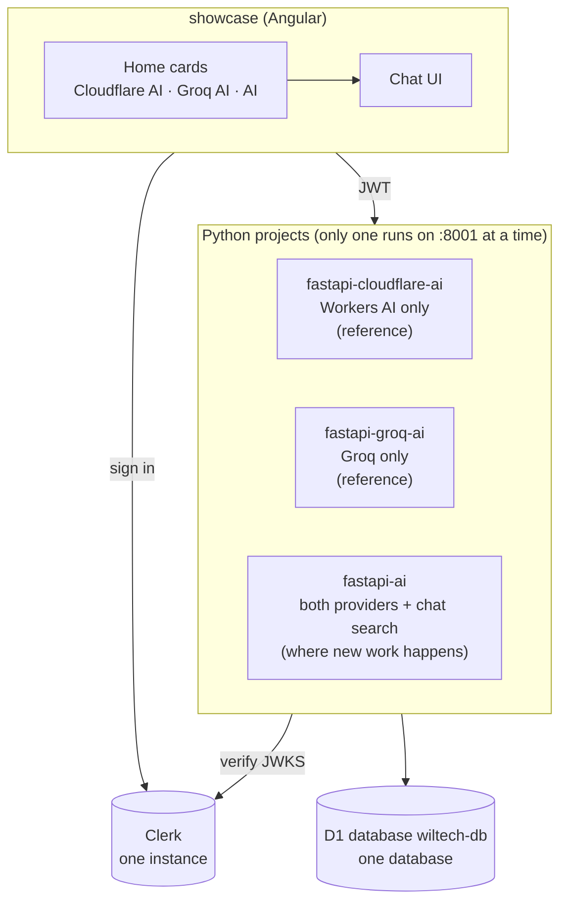
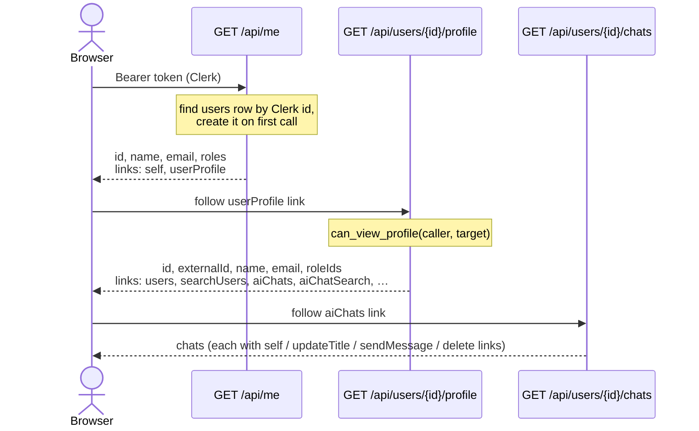
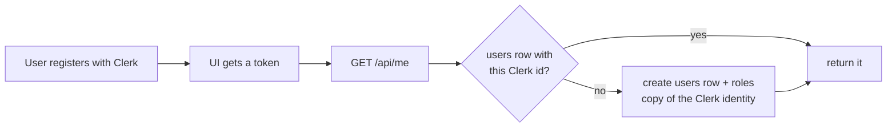
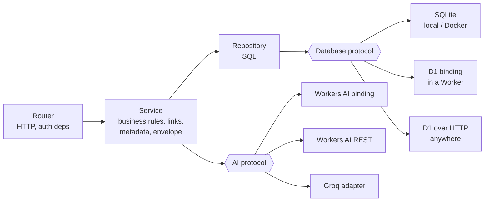
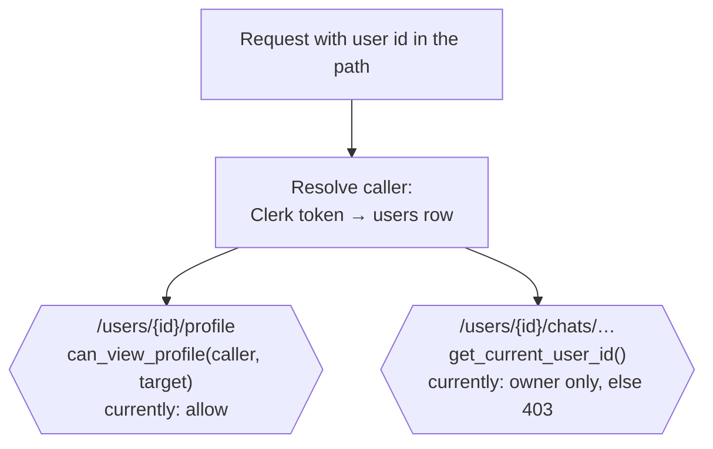
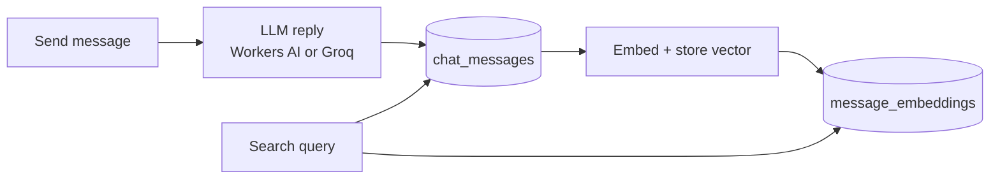

# Architecture overview

How the three Python projects, the Angular showcase and the shared services fit together.

## The projects

All three share the same Clerk instance and the same database. Because the `chats`
table is shared, each project only lists and opens chats for the providers it owns
(`chats.provider`).

## How the UI finds things: `/me` → profile → links

The UI never builds a URL. `/me` only says who you are and points at your profile;
the profile holds every link, built from the user id in the path. That is also where
"may this caller see this user's resources?" belongs.

A Home card is shown only if its link (`cloudflareChats`, `groqChats`, `aiChats`) is on
the profile; otherwise it says "Not found" — meaning "that project isn't the one
answering".

## Users are created on first sign-in

So the `users` table is a local copy of Clerk users who have called the API at least
once. `GET /api/users` lists them and `GET /api/users/search?q=` finds them by name or
email.

## Layers (every project)

The service layer doesn't know which adapter is behind the protocols, which is what
lets the same code run locally and in a Cloudflare Worker.

## Who may see what (business-logic seams)

These two functions are the places to add rules such as "admins can see anyone" or
"members of a team can see each other's chats".

## Chat and search together

Details: [how-ai-search-works.md](how-ai-search-works.md). For questions about any data
(todos, counts, dates) see [ask-your-data.md](ask-your-data.md).
