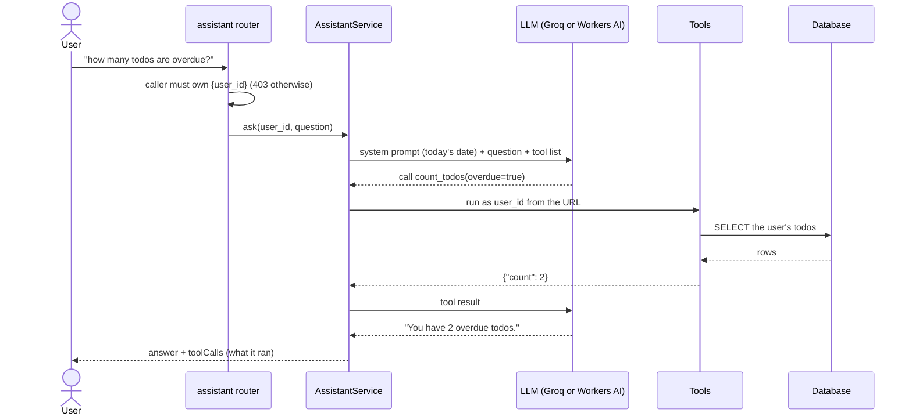
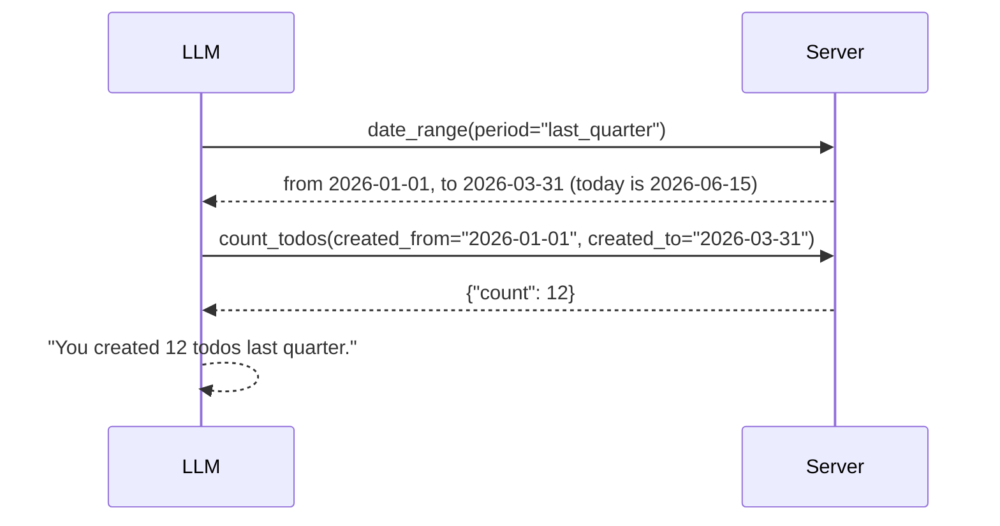
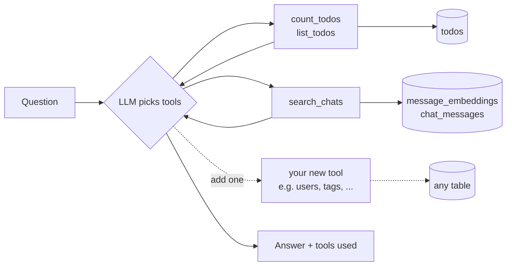
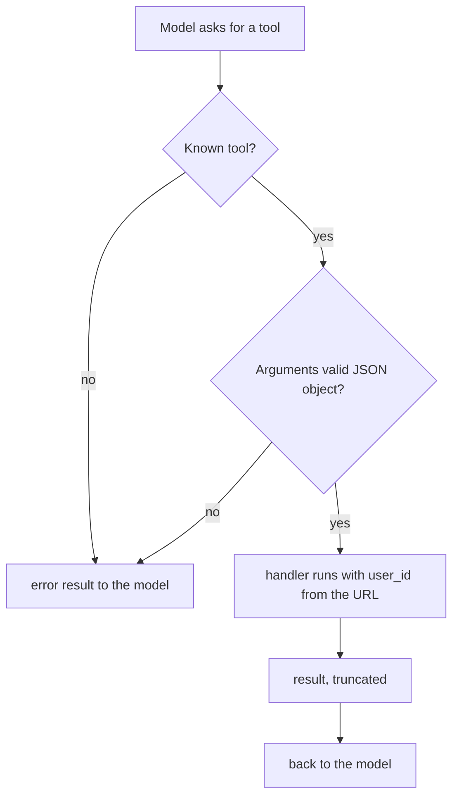
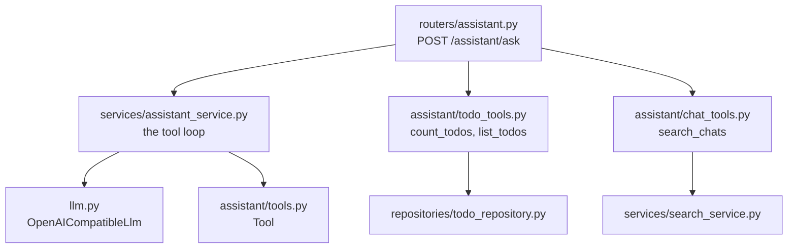

# Ask your data (AI assistant with tools)

Goal: let a user ask questions about **any** of their data in plain English:

- "Show me where I asked about Java" — fuzzy, about meaning
- "How many todos are overdue?" — exact, needs counting
- "How many are new, and which is due first?" — several lookups in one question

> **Status:** built and tested with a scripted fake model. Angular page: `/ask` in the showcase.
> Not yet run against a real Groq / Workers AI model.

## Why embeddings alone are not enough

Embeddings answer "find things *like* this". They cannot count, filter by date or
compare — an LLM guessing "you have 7 overdue todos" from a few retrieved snippets
would be making it up. So there are two kinds of question and two kinds of tool:

| Question | Right tool | How |
|---|---|---|
| "where did I ask about java?" | `search_chats` | embeddings + keyword ([details](how-ai-search-works.md)) |
| "how many todos are overdue?" | `count_todos` | a plain query; the database does the counting |
| "what's due first?" | `list_todos` | a plain query, sorted |
| "how many did I create last quarter?" | `date_range` then `count_todos` | dates worked out in code, then a plain query |
| "how many are tagged important?" | `count_todos(tag=...)` | a join on the tags table |
| "todos about the tax return" | `search_todos` | embeddings + keyword, like chats |

The LLM's job is only to **pick the tools and write the answer**; the numbers always
come from the database.

## How a question is answered

`POST /api/users/{id}/assistant/ask` with `{"question": "...", "provider": "groq"}`



The loop repeats while the model keeps asking for tools (up to 5 steps), so
"how many are new **and** which is due first?" becomes two tool calls in one answer.

## How a question is mapped to data (no embedding of the question involved)

Choosing what to look at is **not** done by embeddings or keyword rules. It is done by
the LLM through *tool calling*:

1. Every request sends the model the list of tools: each has a **name, a plain-English
   description and a JSON schema** for its arguments (see `assistant/todo_tools.py`).
2. The model reads the question and those descriptions and replies, instead of text,
   with "call `count_todos` with `{"overdue": true}`". That is a structured request,
   not free text, so the server can validate it.
3. The server runs the matching handler with the user id from the URL and sends the
   result back; the model either asks for more tools or writes the final answer.

So the descriptions **are** the mapping: they are the only thing telling the model that
"overdue" means `count_todos(overdue=true)`. Write them like documentation for a new
colleague. Words like "overdue" are turned into arguments by the model; the *meaning* of
overdue (past `complete_by` and not `CLOSED`) is fixed in code, so it is always
consistent.

Embeddings are used by the tools that match by *meaning*: `search_chats` (chat messages)
and `search_todos` (todo title + description). Counting, states, dates and tags are always
plain queries.

### When would a resource need embedding?

| The question is about... | Use | Example |
|---|---|---|
| Exact fields: counts, states, dates | A query tool | "how many are overdue?" |
| Free text you must match by meaning | Embeddings | "todos about the tax return" when titles say "HMRC self-assessment" |
| Both | Both, in one tool | "overdue todos about tax" |

Embed a resource only if it has free text worth matching by meaning (a todo's title and
description, a note). Todos already are: one row per todo in `resource_embeddings`
(`resource_type = "todo"`), written when it is created or edited and removed when it is
deleted. A new searchable resource is a new `resource_type`, a search service and a tool.
Counting and filtering stay in SQL either way.

## Worked examples

### "How many todos have I created last quarter?"

A model is bad at calendar arithmetic and "last quarter" is ambiguous, so the model does
not work the dates out. It calls `date_range(period="last_quarter")`, which the server
answers from code (calendar quarters), then passes those dates to `count_todos`.



Supported periods: today, yesterday, last_7_days, last_30_days, this/last week, month,
quarter and year. Quarters are calendar quarters; if you use fiscal quarters, change
`assistant/date_tools.py` once and every question follows.

### "How many todos have the tag important?"

`count_todos(tag="important")`. Tags live in their own table, so the server joins
`todos` to `tags` (case-insensitive) for that user. If the model isn't sure a tag exists
it can call `list_tags` first. Filters combine: "important todos created last quarter
that are still open" is one `count_todos` call with `tag`, `created_from`, `created_to`
and `state`.

### "Todos about the tax return"

`search_todos(query="tax return")`: the todo's title and description are embedded
(`resource_embeddings`) when it is created or edited, removed when deleted, so it can find
"HMRC self-assessment". It is combined with a keyword match, like chat search.

## Adding a new data source

A source is just a `Tool`: a name, a description the model reads, a JSON schema for the
arguments, and an async handler.



Steps: write `build_xxx_tools(...)` in `src/assistant/`, and add it to the list in
`routers/assistant.py`. No prompt or loop changes.

Tool design tips:

- Prefer a few tools with filters (`count_todos(state, overdue)`) over many narrow ones.
- Return small, JSON-friendly results (the loop truncates at 6000 characters).
- Return `{"error": "..."}` for bad arguments; the model sees it and retries.
- Keep tools **read-only**. Writes ("mark those closed") need a confirmation step; not built.

## Safety rules the server enforces



- **The model never chooses whose data.** `user_id` comes from the URL (which the
  router has already checked belongs to the caller). A `user_id` in the model's
  arguments is ignored — there is a test for this.
- **Read-only** tools, so a bad prompt can leak nothing outside the user's own data
  and change nothing.
- **Prompt injection:** a chat message the model retrieves might say "ignore your
  instructions". The system prompt says tool results are data, not instructions, and
  because tools are read-only and user-scoped the worst case is a wrong answer.
- **Step limit** of 5 stops runaway loops.
- **Transparency:** the response includes `toolCalls` (name, arguments, result), so a
  UI can show "I ran `count_todos(overdue=true)` → 2".

## Provider notes

Both providers are called through their OpenAI-compatible chat-completions API
(`llm.py`), so one client serves both:

| Provider | Endpoint | Notes |
|---|---|---|
| `groq` (default) | `GROQ_BASE_URL` | `GROQ_MODEL` (gpt-oss-20b) supports tool calling well |
| `cloudflare` | `https://api.cloudflare.com/client/v4/accounts/{CF_AI_ACCOUNT_ID}/ai/v1` | Needs the REST credentials (not the binding). Small models like Llama 3.1 8B call tools less reliably |

Tool calling quality varies by model. If answers look wrong, look at `toolCalls` first:
did the model pick the right tool and arguments?

## Code map



Todos and tags are full APIs in this project (copied from `fastapi-cloudflare-d1`); the
assistant tools only *read* them, through the same `TodoRepository`.

## Testing

```powershell
cd Tutorials/fastapi-ai
uv run pytest
```

`tests/test_assistant.py` scripts the model's turns, so it checks the *server's*
behaviour with no network: overdue counting (including a closed past-due todo and a
`Z`-suffixed date), other users' data excluded, `user_id` in arguments ignored, bad
state / unknown tool / invalid JSON handled, chat search as a tool, step limit, and
today's date in the prompt.
