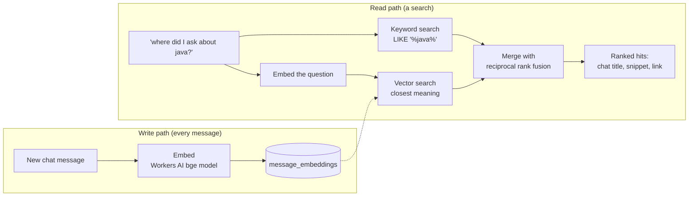
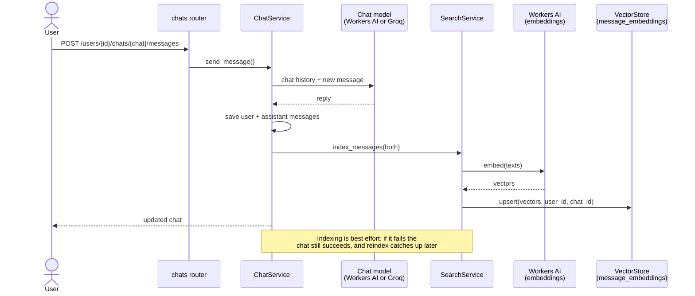
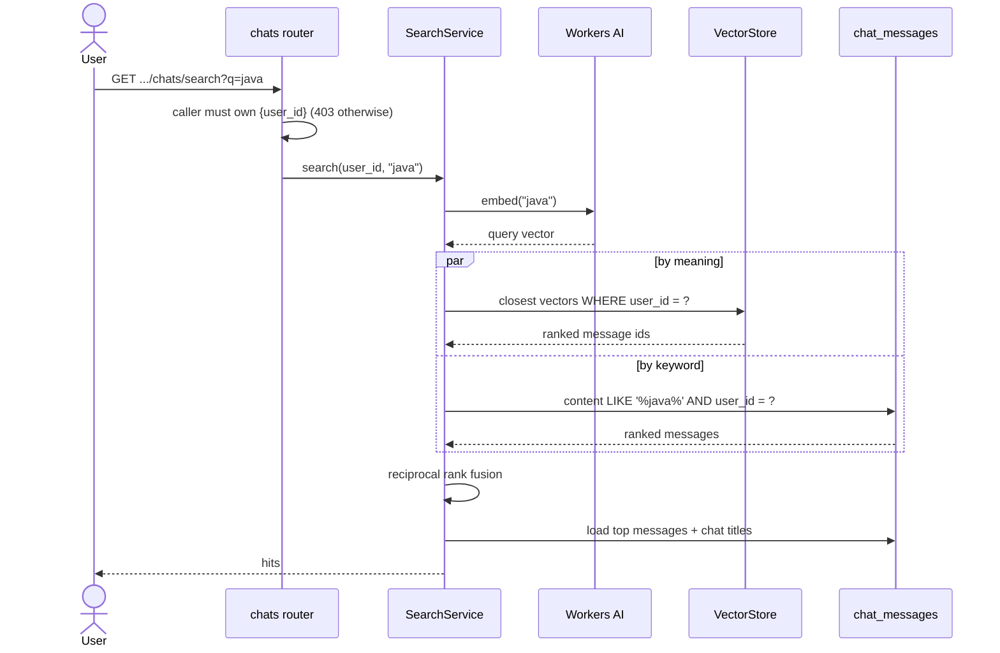
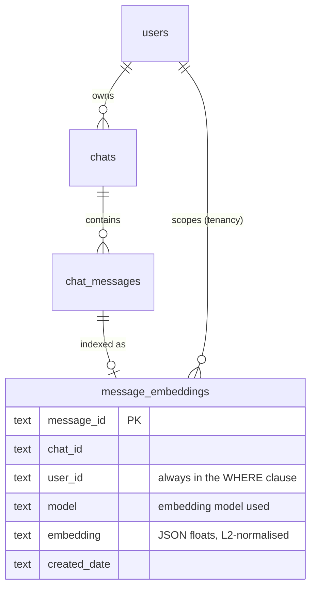

# How AI search works

Search over a user's chat history: "show me where I asked about Java".

We can't send thousands of messages to an LLM, so we **retrieve first**: turn every
message into an *embedding* (a list of numbers that captures its meaning), and at
search time find the messages whose numbers are closest to the question's.

> Chat search is one tool of the wider assistant in [ask-your-data.md](ask-your-data.md).

> **Status:** MVP is built and tested (`find` mode). Not built yet: `ask` mode (LLM
> answer with citations), Cloudflare Vectorize adapter, chunking of long messages,
> the Angular search page. See [ai-search-plan.md](ai-search-plan.md).

## The idea in one picture



Only the few best snippets ever leave the database, so cost and latency stay flat
however much history a user has.

## Write path: indexing a message

Happens inside `ChatService.send_message`, right after the assistant replies.



- Embeddings always come from Workers AI (`CF_EMBEDDING_MODEL`, default
  `@cf/baai/bge-base-en-v1.5`, 768 dimensions), even when a chat is answered by Groq.
- Long messages are truncated to 2000 characters for now (chunking is a later phase).
- Deleting a chat also deletes its vectors.
- `POST /users/{id}/chats/search/reindex` embeds any messages not indexed yet
  (existing history, or anything a failed call missed).

## Read path: answering a search

`GET /users/{id}/chats/search?q=java&limit=10`



### Why two searches?

| | Finds | Misses |
|---|---|---|
| **Vector** (meaning) | "Spring Boot", "the JVM" for the query "java" | Exact rare words, IDs, names |
| **Keyword** (`LIKE`) | Messages that literally say "java" | Anything phrased differently |

Together they cover both. Each returns a ranked list; **reciprocal rank fusion**
merges them without having to compare their incompatible scores:

```
score(message) = Σ over lists of  1 / (60 + rank in that list)
```

A message near the top of *both* lists wins; a message in only one still appears.
Each hit says whether it was also a `keywordMatch`.

### What a hit looks like

```json
{
  "_data": { "hits": [{
    "messageId": "…", "chatId": "…", "chatTitle": "Java help",
    "role": "user", "snippet": "How do I use the JVM?",
    "score": 0.0323, "keywordMatch": false,
    "created_date": "2026-01-01T00:00:00Z",
    "links": { "chat": { "href": "/api/users/{id}/chats/{chatId}", "method": "GET" } }
  }]},
  "_metaLinks": { "search": {…}, "reindex": {…} }
}
```

## Data model



A row in `message_embeddings` means "this message is indexed". Vectors are stored
normalised, so cosine similarity is a plain dot product.

## Code map

```mermaid
flowchart TD
    R[routers/chats.py<br/>GET /chats/search<br/>POST /chats/search/reindex] --> SS[services/search_service.py<br/>index, reindex, search, RRF]
    CS[services/chat_service.py<br/>indexes after a reply,<br/>removes on delete] --> SS
    SS --> EMB[embeddings.py<br/>embed() via Workers AI]
    SS --> VS[vector_store.py<br/>VectorStore protocol]
    SS --> CR[repositories/chat_repository.py<br/>keyword search, message loading]
    VS --> DVS[DatabaseVectorStore<br/>SQLite / D1]
    VS -.future.-> VEC[Cloudflare Vectorize adapter]
    EMB --> AI[ai.py AI protocol]
```

`VectorStore` is a protocol, the same pattern as `Database` and `AI`: the search
service doesn't know where vectors live.

## Why the database is the vector store (for now)

The plan called for Cloudflare Vectorize. The MVP stores vectors in the same
SQLite/D1 database and ranks them in Python (brute-force cosine over **one user's**
rows), because:

- it runs the same locally and deployed, with no extra infrastructure;
- it is fully testable offline;
- one user's history (thousands of messages) is small enough for this.

When that stops being true — very large histories, or a Worker's CPU limit — add a
Vectorize adapter that implements `VectorStore`; nothing else changes.

## Running the tests

```powershell
cd Tutorials/fastapi-ai
uv run pytest
```

The tests use a fake embedder (words mapped onto a few topic axes) and a temporary
SQLite file, so they need no network or Cloudflare account. They check: finding by
meaning with no shared words, keyword matches, per-user isolation, reindex only
filling gaps, chat deletion removing vectors, blank queries and the limit.
