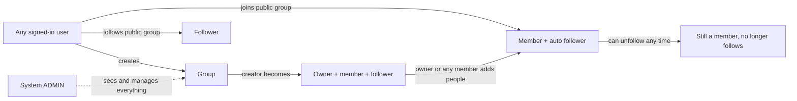
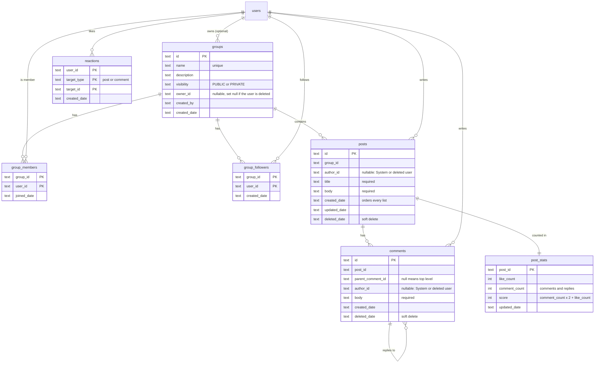
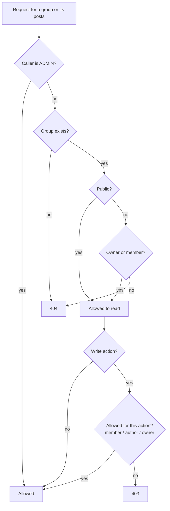
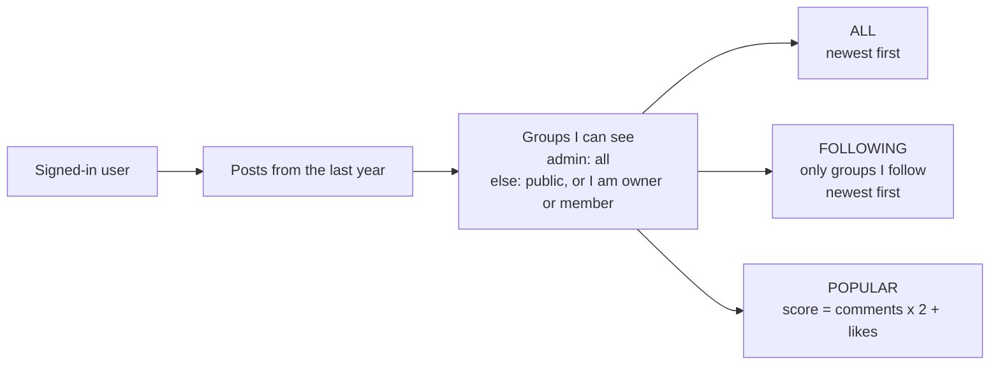
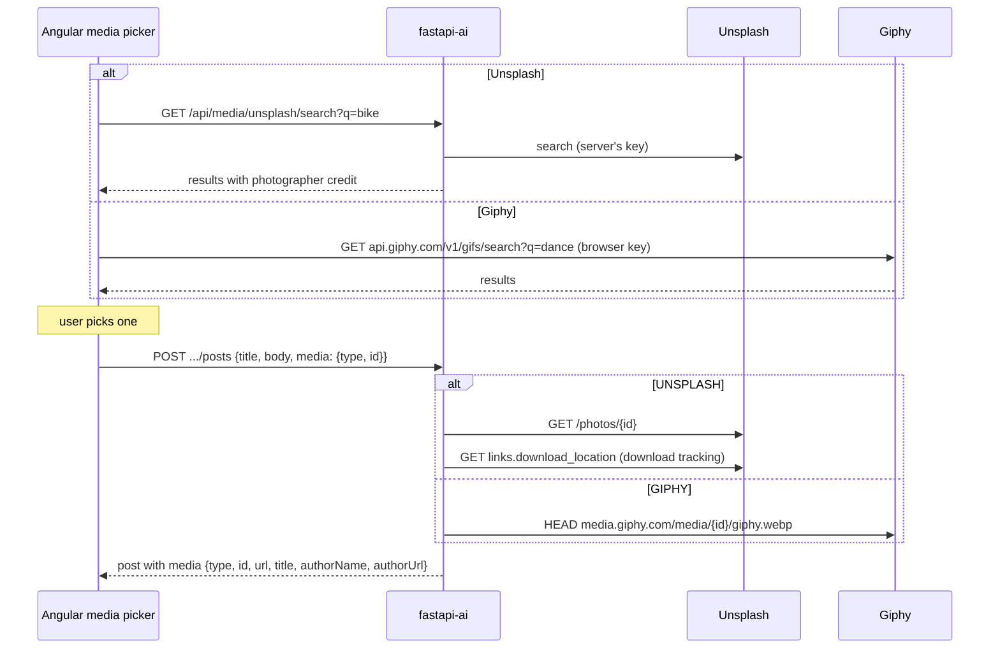
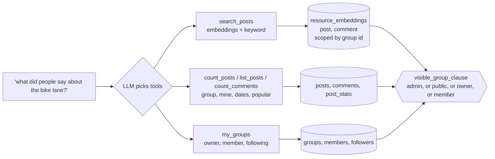

# Social groups (Reddit-style): design

Users create **groups** (public or private), post to them, and other people like and comment on
posts and reply to comments. Users can **be a member** of a group or just **follow** it, and each
user has a **timeline** built from the groups they can see.

> **Status:** revision 7. **All steps built (1-7)**: groups, members, owner, followers, role re-sync;
> posts and post comments (separate APIs), News seed; likes, `post_stats` and the admin area
> (`GET /api/admin`); timeline; Angular pages in `demo-ui` (`/timeline`, `/groups`, `/admin`);
> post media (Unsplash, Giphy, YouTube); AI search and Ask over posts and comments. Items marked **(decision)** can still be changed.

## Roles: two different things

| Term | Where it comes from | Scope |
|---|---|---|
| **Admin** | The user's system role: `ADMIN` in the `users` / `user_roles` tables, copied from the Clerk token's `roles` claim | Whole app. **Bypasses group security** |
| **Standard user** | Same place: `STANDARD` (assigned when the Clerk `roles` array is empty or has no `ADMIN`) | Whole app |
| **Owner** | A standard user who owns a group (`groups.owner_id`) | One group |
| **Member** | A user in `group_members` | One group |
| **Follower** | A user in `group_followers` | One group |

There is **no group-level admin role**. "Admin" always means the system `ADMIN` role.

How a user's role is set (existing code, `MeService`): on `/me`, the Clerk `roles` claim is
read; if it contains `ADMIN` the user gets `ADMIN`, otherwise (including an empty array) they
get `STANDARD`.

> **Gap to fix in step 1:** today roles are copied only when the `users` row is **first
> created**. If someone is made admin in Clerk later, our row stays `STANDARD`. The plan is
> to re-sync roles from the token on every `/me` call, so Clerk stays the source of truth.

## Concepts

| Concept | Meaning |
|---|---|
| **Public group** | Anyone signed in can see it, read its posts, follow it and join it. |
| **Private group** | Only the owner, its members and admins can see it or its posts. |
| **Owner** | The creator, initially. Optional: a group keeps working if the owner is deleted. |



## Rules

1. **Anyone can create a group** (public or private). The creator becomes the **owner**, a
   member and a follower.
2. **A group does not need an owner.** If the owner's user is deleted, `owner_id` becomes empty
   and the group carries on. Only an admin can then manage it or assign a new owner.
3. **Changing owner:** the current owner or an admin can assign a different owner.
   **(decision)** The new owner must already be a member; if not, add them first.
4. **Owners and members are auto-followed.** Becoming a member or owner creates a follower row.
   Users can unfollow at any time; unfollowing does not end membership, it only drops the group
   from their FOLLOWING timeline. Leaving a public group does not unfollow it.
5. **Private groups are invisible to outsiders.** A non-member gets `404 Group not found`
   (not 403, so its existence isn't leaked).
6. **Joining and adding people:** anyone can join a public group themselves. A private group is
   only visible to its owner and members, so **only the owner or an existing member** (or an
   admin) can add someone to it. The same applies to adding someone to a public group.
   **(decision)** Removing someone else stays with the owner or an admin.
7. **Being added works like joining:** the new member automatically follows the group and can
   unfollow at any time. **Leaving or being removed ends membership and also removes the
   follower row**, for private groups. **(decision)** For public groups a leaver keeps
   following, since they could follow it anyway.
8. **Admins bypass group security.** They can see every group, post and comment (public or
   private), post, comment and like anywhere, delete any group, post or comment and assign
   owners, all without being a member.
9. **Posts need a title and a body.** Both are required.
10. **Posts are ordered by creation date and time, newest first.**

## Who can do what

| Action | Outsider | Follower | Member | Owner | Admin |
|---|---|---|---|---|---|
| See a public group and its posts | yes | yes | yes | yes | yes |
| See a private group and its posts | no (404) | no (404) | yes | yes | **yes** |
| Follow / unfollow | follow public only | unfollow | yes | yes | yes |
| Join / leave | join public | join public | leave | leave* | n/a |
| Post, comment, reply, like | no | no | yes | yes | **yes** |
| Edit own post or comment | | | yes | yes | yes |
| Delete own post or comment | | | yes | yes | yes |
| Delete anyone's post or comment | no | no | no | yes | **yes** |
| Add a member | no | no | yes | yes | **yes** |
| Remove another member | no | no | no | yes | **yes** |
| Edit group, change visibility | no | no | no | yes | **yes** |
| Assign a different owner | no | no | no | yes | **yes** |
| Delete the group | no | no | no | yes | **yes** |

\* An owner who leaves stops being owner; the group becomes ownerless. **(decision)**

Admins bypass **all** group security, including writing: they can post, comment, reply and
like in any group, public or private, without joining.

**(decision)** Admins can delete but not edit other people's posts and comments, so nobody's
words are changed under their name.

Every one of these questions is answered by **one class**, `GroupPermissions`, used by the
API, the timeline and the AI tools, so the rules can't drift apart. Its first check is always
"is the caller an admin? then allow".

## Data model



- **Owner** is a nullable column on the group. **Membership** has no role column. **Admin**
  comes from the existing `user_roles` table.
- **Following is its own table**, independent of membership.
- **Replies** are comments with a `parent_comment_id`. Any depth is stored; the API returns
  replies flat with their parent id and the UI indents.
- **Likes:** one row per user per target, so nobody likes twice. Like only, no downvotes.
- **`post_stats`** holds each post's counts and popularity **score**, so POPULAR doesn't have
  to count likes and comments for every post on every request:

  ```
  score = comment_count x 2 + like_count     (a comment or reply is worth 2, a like 1)
  ```

  One row per post, created with the post and updated in the same service call as the change
  that affects it: like / unlike a post, add / delete a comment or reply. Likes on comments
  don't change the post's score. Soft-deleted comments stop counting. **(decision)** A repair
  job (`POST /api/admin/post-stats/rebuild`, admin only) recomputes every row from the source
  tables, in case they ever drift.
- **Soft delete** for posts and comments so replies keep their parent ("[deleted]").
  **(decision)** Deleting a group removes its posts, comments, reactions, members and
  followers for good.
- **Indexes** for the timeline: `posts(group_id, created_date)`, `posts(created_date)`,
  `comments(post_id)`, `reactions(target_type, target_id)`, `post_stats(score)`.

## Seed data: the News group

A migration ships one group so there is something to see on a fresh database:

| Field | Value |
|---|---|
| `id` | fixed UUID, so the migration is idempotent (`INSERT OR IGNORE`) |
| `name` | `News` |
| `visibility` | `PUBLIC` |
| `owner_id` | `NULL` (only admins manage it) |
| `created_by` | `NULL` (system) |

Plus about 10 dummy posts, spread over the last few weeks so the timeline ordering is visible,
with a few comments, replies and likes so POPULAR has something to rank.

**(decision)** Seeded posts and comments have `author_id = NULL`, shown as **"System"**. Real
users may not exist yet when the migration runs, and a fake user row would show up in
`/api/users`. So `posts.author_id` and `comments.author_id` are nullable (which also covers a
deleted author). Seeded likes need real users, so they are skipped; seeded comments count
towards POPULAR instead.

Nobody is a member or follower of News on a fresh database. It still appears in `ALL` and
`POPULAR` for everyone because it is public; users can follow it to get it in `FOLLOWING`.

## Visibility: one predicate everywhere

A user can see a group when **they are an admin**, or it is `PUBLIC`, or they are its owner,
or they are a member. This one rule is applied by the group endpoints, the posts endpoints,
the timeline and the AI tools.



## API

The caller is always the signed-in user. Everything about a group, its posts and their
comments is **nested under `/groups/{groupId}`**, so the group's visibility is checked on every
request, including for a single post or comment. There is no way to reach a private post
without going through its group.

### Groups

| Method | Path | Purpose |
|---|---|---|
| GET | `/api/groups` | Groups you can see (admins: all). `?q=` searches by name, `?following=true` only those you follow, `?mine=true` only those you belong to |
| POST | `/api/groups` | Create a group (`name`, `description`, `visibility`). Caller becomes owner, member and follower |
| GET | `/api/groups/{groupId}` | One group (404 if private and you can't see it) |
| PUT | `/api/groups/{groupId}` | Edit name, description, visibility (owner or admin) |
| DELETE | `/api/groups/{groupId}` | Delete (owner or admin) |
| PUT | `/api/groups/{groupId}/owner` | Assign a different owner `{userId}` (owner or admin) |

### Members

| Method | Path | Purpose |
|---|---|---|
| GET | `/api/groups/{groupId}/members` | Members, with who is owner |
| PUT | `/api/groups/{groupId}/members/me` | Join a public group |
| DELETE | `/api/groups/{groupId}/members/me` | Leave |
| PUT | `/api/groups/{groupId}/members/{userId}` | Add a member; they also start following (owner, member or admin) |
| DELETE | `/api/groups/{groupId}/members/{userId}` | Remove a member; a private group also unfollows them (owner or admin) |

### Followers

| Method | Path | Purpose |
|---|---|---|
| GET | `/api/groups/{groupId}/followers` | Who follows the group |
| PUT | `/api/groups/{groupId}/followers/me` | Follow (public groups, or a private group you belong to) |
| DELETE | `/api/groups/{groupId}/followers/me` | Unfollow, any time |

### Posts, comments, likes (all under the group)

| Method | Path | Purpose |
|---|---|---|
| GET | `/api/groups/{groupId}/posts` | The group's posts, newest first (`limit`) |
| POST | `/api/groups/{groupId}/posts` | Create a post; `title` and `body` required (member) |
| GET / PUT / DELETE | `/api/groups/{groupId}/posts/{postId}` | Read, edit (author), delete (author, owner, admin) |
| GET | `/api/groups/{groupId}/posts/{postId}/comments` | Comments, oldest first, with `parentCommentId` |
| POST | `/api/groups/{groupId}/posts/{postId}/comments` | Comment, or reply with `parentCommentId` (member) |
| PUT / DELETE | `/api/groups/{groupId}/posts/{postId}/comments/{commentId}` | Edit (author), delete (author, owner, admin) |
| PUT / DELETE | `.../posts/{postId}/like` and `.../comments/{commentId}/like` | Like / unlike |
| PUT / DELETE | `.../posts/{postId}/media` | Add / remove the post's media (author); see [Post media](#post-media) |
| GET | `/api/media/unsplash/search?q=` | Unsplash search for the media picker (`limit`, default 20, max 30). Giphy is searched from the browser |

### Timeline (your feed)

`GET /api/timeline/posts?type=FOLLOWING|POPULAR|ALL&limit=50`

No user id in the path: it is always about the signed-in user. `type` takes one of three
values (default `ALL`).

- **Time window: 1 year.** All three types only include posts created in the last 365 days.
- **No paging for now.** `limit` (default 50, max 100) caps the list. Paging (`offset` or a
  cursor) can be added later without changing the response shape.

| `type` | Posts returned | Order |
|---|---|---|
| `ALL` | Every post you're allowed to see from the last year (public groups, private groups you belong to; admins: everything) | Creation date and time, newest first |
| `FOLLOWING` | Posts from the last year in groups you follow (still only those you can see) | Creation date and time, newest first |
| `POPULAR` | Every post you're allowed to see from the last year | `post_stats.score` highest first (comment or reply = 2, like = 1), ties broken by newest |



`FOLLOWING` and `POPULAR` still apply the visibility rule, so a leftover follow of a private
group you were removed from can never leak its posts.

Each timeline item is a post with its group (`groupId`, `groupName`), author, `likeCount`,
`commentCount`, `likedByMe`, and links (`self`, `group`, `comments`, `like`) pointing at the
nested paths, so the UI never builds a URL. The profile links `groups`, `createGroup`,
`timelineAll`, `timelineFollowing` and `timelinePopular`.

**Links carry the permissions:** a post only gets `delete` if the caller may delete it (its
author, the group owner or an admin), a group only gets `join` if they can join it, and so on.

## Post media

A post can carry **one** optional piece of media, from one of three sources:

| Type | Searched | Key and where it lives | What the post stores |
|---|---|---|---|
| `UNSPLASH` | **Server**: `GET /api/media/unsplash/search?q=` (profile link `searchUnsplash`) | `UNSPLASH_ACCESS_KEY`, server only (`.env` / wrangler secret) | Photo id, image URL, alt text, photographer name and profile link |
| `GIPHY` | **Browser**: the picker calls `api.giphy.com` directly | `giphyApiKey` in `demo-ui`'s `src/environments` (a client key, it ships in the bundle) | GIF id, and the URL built from it |
| `YOUTUBE` | Nothing to search: paste a link or id | none | The 11-character video id only (e.g. `dQw4w9WgXcQ`) |

**Rules**

- Media is optional and there is at most one per post (`posts.media_*` columns, migration 012).
- The client only ever sends `{"type": "...", "id": "..."}`, on create (`media` in the
  `POST .../posts` body) or on `PUT .../posts/{postId}/media`. The server works out everything
  else itself, so nobody can put an arbitrary URL on a post. A bad or unknown id is a **400** and
  nothing is saved.
  - Unsplash: `GET /photos/{id}` with the server's key gives the URL, alt text and photographer.
  - Giphy: the server needs no key. It checks the id's format, builds
    `https://media.giphy.com/media/{id}/giphy.webp` and confirms it exists with a `HEAD`.
  - YouTube: the id is checked against `^[A-Za-z0-9_-]{11}$`; YouTube is never called. The UI
    accepts a pasted `youtube.com/watch?v=`, `youtu.be/`, `/shorts/` or `/embed/` link and sends
    only the id.
- **Editing media means remove, then add.** There is no "change media": the author gets a
  `removeMedia` link (DELETE) when the post has media and an `addMedia` link (PUT) when it
  doesn't. Only the author gets either; owners and admins can still delete the whole post.
- A deleted post shows no media.
- Without `UNSPLASH_ACCESS_KEY` the Unsplash routes answer **503** (and the UI still offers GIFs
  and YouTube); an Unsplash outage is **502**. An empty `giphyApiKey` hides the GIF tab.



**Unsplash API requirements**

- **Track downloads.** Unsplash requires a download event whenever a photo is picked for use:
  a `GET` on the photo's `links.download_location` with `Authorization: Client-ID <access key>`.
  We fire it on the server when the photo is attached to a post (create or `addMedia`), right
  after looking the photo up. The key never reaches the browser, and browsing the search
  results doesn't count as a download. Covered by
  `test_attaching_an_unsplash_photo_tracks_the_download`.
- **Attribute.** Every photo shows "Photo by *name* on Unsplash": the name links to
  `user.links.html` and "Unsplash" to `https://unsplash.com/`, both with
  `?utm_source=wiltech&utm_medium=referral`. The server stores the photographer link with the
  UTM parameters already on it.
- **Hotlink.** Images are shown from Unsplash's own `images.unsplash.com` URL (`urls.regular`),
  never copied. The photo's `alt_description` is used as the image's alt text.

**Other providers**

- Giphy: searches use `rating=pg-13`; the picker shows "Powered by GIPHY" and posts "via GIPHY".
- YouTube: embedded from `youtube-nocookie.com`. In lists (timeline, group page) the video shows
  as its thumbnail and only loads the player when clicked.

**UI.** The picker shows Unsplash only when the profile has the `searchUnsplash` link, GIFs only
when `giphyApiKey` is set, and YouTube always. Searches run on **Search** or Enter, not on every
keystroke. The group page's new-post form has **Add media**, and the post page has **Add media**
/ **Remove media** following the post's links.

**Setup.**
- Unsplash: put `UNSPLASH_ACCESS_KEY` in `.env` (see `.env.example`). On Cloudflare, run
  `npx wrangler secret put UNSPLASH_ACCESS_KEY`. `UNSPLASH_SECRET_KEY` is kept in `.env` for a
  future OAuth flow but isn't used.
- Giphy: set `giphyApiKey` in `demo-ui/src/environments/environment*.ts`. It is public by nature
  (it runs in the browser), so restrict it in the Giphy dashboard.
- A D1 database created before this feature needs `migrations/012_add_post_media.sql` run once:
  `npx wrangler d1 execute wiltech-db --remote --file migrations/012_add_post_media.sql`.

## How it plugs into AI search and Ask

Post titles, bodies and comments are free text, so this follows the README checklist
("Adding a new resource to AI search and Ask"): embeddings for meaning and query tools for
counts. Built in step 5.



**Whose data a tool may see.** Todos and chats are private, so their tools only need the path
`user_id`. Posts are shared, so the social tools are built per request for the caller (their id
and system role) and **every query goes through `visible_group_clause`**, the SQL twin of
`GroupPermissions.can_view` that group lists and the timeline also use. The assistant can only
count, list or find what the caller could open in the app; an outsider asking about a private
group by name gets "no group called ... that you can see", so it doesn't even learn the group
exists. Admins see everything, as in the API.

| Tool | Answers | Source |
|---|---|---|
| `count_posts` | "how many posts did I write this month?" | `posts` with filters `group`, `mine`, `created_from/to` |
| `list_posts` | "what's my most liked post?", "latest posts in News" | Same filters, `sort=newest` or `popular` (`post_stats.score`) |
| `count_comments` | "how many comments have I made in Cyclists?" | `comments`, same filters |
| `my_groups` | "which of my groups is most active?" | Groups owned, joined or followed, with member and post counts, last post date |
| `search_posts` | "what did people say about the bike lanes?" | Embeddings plus keyword, merged with reciprocal rank fusion; a comment match returns its post with `matching_comment` |

**Search index.** Posts (title and body) and comments are embedded into `resource_embeddings`
as `resource_type` `post` and `comment`. The row's scope column (`user_id`) holds the **group
id**, so a search only reads vectors from groups the caller can see right now, and the matching
posts are then re-read through the visibility filter (a vector is never trusted on its own).
Making a group private hides its posts from search at once; nothing needs re-indexing.

Ranking works at post level with one list per signal. **Meaning:** a post's similarity is the best
of its own vector and its comments' vectors (the best comment is shown as `matching_comment`).
**Keyword:** posts whose title or body match, then posts with a matching comment. The two lists
are merged with reciprocal rank fusion, so a post isn't boosted just for having many comments.

- Creating or editing a post or comment embeds it; deleting removes the vector; deleting a
  group removes all of its vectors. This is **best effort**: if Workers AI is down the write
  still succeeds.
- **Admin > Index posts for AI search** (`POST /api/admin/post-search/reindex`) embeds every
  live post and comment that has no vector yet. Run it once after deploying, so the seeded
  News posts become searchable, and any time indexing was missed.

## Build plan

1. **Groups, membership, owner, followers:** migrations, models, repositories, services,
   `GroupPermissions` (admin bypass first), routers, tests, profile links. Also re-sync the
   user's roles from the Clerk token on every `/me`.
2. **Posts and comments** under `/groups/{groupId}`: visibility check on every route, threaded
   replies, soft delete, permission links, tests. Seed migration for the **News** group and its
   dummy posts and comments.
3. **Likes and stats:** reactions, `post_stats` kept in step with likes and comments,
   `likedByMe`, stats rebuild endpoint.
4. **Timeline:** `ALL`, `FOLLOWING`, `POPULAR`, 1-year window, `limit`, tests for private-group
   leakage, the window and the admin bypass.
5. **AI:** embeddings for posts and comments, tools with visibility scoping, admin reindex, docs.
6. **Angular:** timeline page with the three tabs, groups list, group page, post page with
   threaded comments, members and follow controls.
7. **Post media:** one optional Unsplash photo, Giphy GIF or YouTube video per post; server-side
   search and lookup; picker and display in the UI.

Each step is independently shippable.

## Open questions

None for now. Items marked **(decision)** can still be changed.
